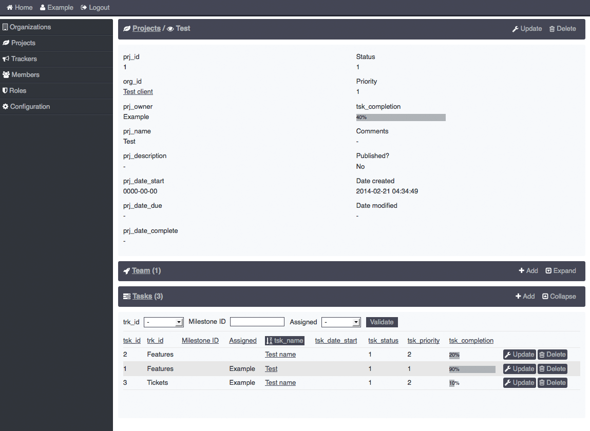

New experimental phpCollab, not for production

#####Demo
http://sdion.net/phpcollab
```text
example@example.com
example
```

#####Screenshots



#####Installation
Edit [/application/config/database.php](/application/config/database.php) to define "username", "password" and "database" ("hostname" if necessary)

Load SQL commands from [/INSTALL.sql](/INSTALL.sql) in your database

Default member
```text
example@example.com
example
```

#####Started
* Members
* Organizations
* Projects
* Teams
* Tasks
* Milestones
* Trackers
* Statuses
* Files
* Notes
* Topics / Posts
* Notifications
* Permissions / Roles
* Logs
